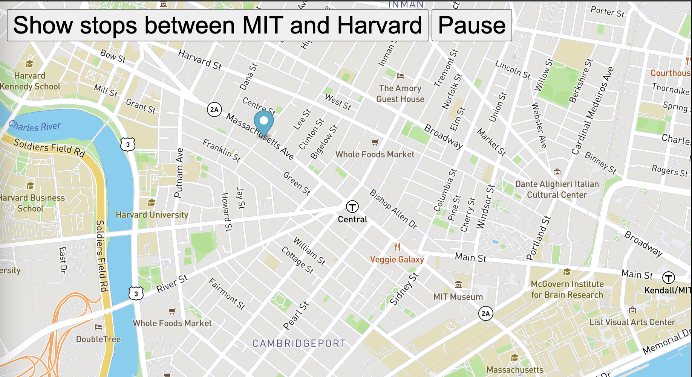

# Bus Tracking
MIT XPro Course Assignment 

## Contents
[mapanimation.js](mapanimation.js)
[index.html](index.html)
[styles.css](styles.css)

## Setup
- To run the code, open index.html in a web browser.

## In the future, I would like to add a map for Chicago and sync public transport the api into that map.

i struggled with this one so I had to look at solutions from other students like https://github.com/codeforboston/MBTA-API-API.git
